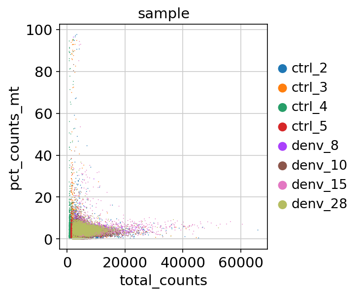
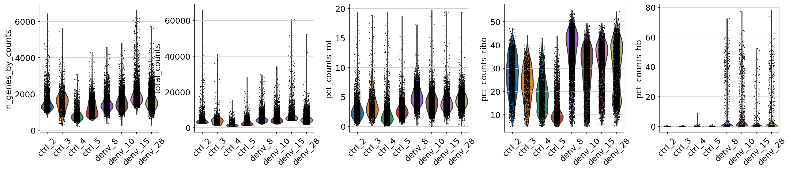

<h1 align="center">  Single_cell analysis report for 2021 class </h1>

## About Dengue: What You Need to Know

Dengue viruses are spread to people through the bite of an infected Aedes species (Ae. aegypti or Ae. albopictus) mosquito. These mosquitoes also spread Zika, chikungunya, and other viruses.
Dengue is common in more than 100 countries around the world.
Forty percent of the world’s population, about 3 billion people, live in areas with a risk of dengue. Dengue is often a leading cause of illness in areas with risk.
Each year, up to 400 million people get infected with dengue. Approximately 100 million people get sick from infection, and 22, 000 die from severe dengue.
Dengue is caused by one of any of four related viruses: Dengue virus 1, 2, 3, and 4.  For this reason, a person can be infected with a dengue virus as many as four times in his or her lifetime [1](https://www.cdc.gov/dengue/index.html "CDC").

>Each year, up to 400 million people get infected with dengue.

## INTRODUCTION

Dengue virus infection has many manifestations, including asymptomatic symptoms, dengue fever (DF) or more severe forms such as dengue hemorrhagic fever (DHF) and dengue shock syndrome (DSS) in affected individuals. Biomarkers provide a dynamic and effective method for understanding diseases and can be used in observational and analytical epidemiology, randomized clinical trials, screening, diagnosis, and prognosis. When choosing the appropriate  treatment, because the vaccine has not been approved for immunization, the early prognosis is very important for patients who have no warning signs but may develop severe dengue hemorrhagic fever later. Severe reactions of dengue fever include T and B storm cell activation and cytokine apoptosis, hematological abnormalities, and complement activation. Unknown factors such as cytokines and complement can temporarily affect the endothelium and change the barrier function of body fluids causing normal endothelial cells and plasma leakage. The host factors such as complemently activated immune and endothelial cells and their products due to dengue disease can be used as biomarkers for severe dengue fever.[2](https://dx.doi.org/10.1186%2Fs12929-015-0191-6 "DENV").

The severiety of dengue disease progression varies depending on the subject or individual.However the mechanism of the severe dengues disease(SD) is poorly understood. The advance of high throughput technology and capabilities to process large data which are being generated exponential can be helpful in aiding in understanding the mechanism behind the severe dengue disease. Over the course of time single cell technology have evolved and lower the cost of sequencing large genome data and also a resolution of much lower depth enabling us to analyse these hight throughput data at a single cell level.

The major factor contribution to the  dengue pathogenesis is considered to the human immune resposes.With the help of opsonizing antibodies, DENV virus infection increases the process of plasma loss, shock and bleeding manifestations, leading to changes in the immune response, which triggers the activation of T cells and the release of cytokines and chemical mediators which are known to be as the risk factors for secondary infection.[3](https://jbiomedsci.biomedcentral.com/articles/10.1186/s12929-015-0191-6#ref-CR3)

fever is one of the most commont symptoms of Dengue patients which is exhibited  during the period of maximum viremia, and DHF/DSS will appear when the virus is cleared from the blood, which indicates that severe dengue fever may be related to immunopathology. This indicates that components of human immune resposes like complements, cytokines and other cellular mediators can be used as biomarkers of serious diseases. So, in this work by analysis of the human immune resposes through analysis of single Cell of peripheral blood mononuclear cell(PMBC) was carried out to elucidate the severe dengue disease meachanism and identify human key factors that can be used for as early detection of severe dengue disease[4](https://jbiomedsci.biomedcentral.com/articles/10.1186/s12929-015-0191-6#ref-CR7).

> Early detection of SD based on molecular features of the patients blood can save lives.

Analysis of blood or peripheral blood mononuclear cells (PBMCs).

======

## Results and Discussion

The data consists of **4** individuals with **Dengue Positive** and **4 Dengue Negative** or Control and therefore has 8 datsets in total.

| Serial | Control | DENV    |
| ------ | ------- | ------- |
| 1      | ctrl_2  | denv_8  |
| 2      | ctrl_3  | denv_10 |
| 3      | ctrl_4  | denv_15 |
| 4      | ctrl_5  | denv_28 |

---

Initial QC of data if of very important as it can help in identifying noises and remove these artifacts that may have adverse effect of the further downstream analysis.

The datasets was Standardize  for each same and merged for  the analysis by using **scanpy** package.

Annotation of the genes and custering this highly dimensions data is required to identify groups of cells based on the similarities of the transcripts without any prior knowledge of the labels. Moreover, in most situations we do not even know the number of clusters a priori. The problem is made even more challenging due to the high level of noise (both technical and biological).

For More Visit  [**Takshan Wiki**](https://github.com/Takshan/Single_cell/wiki)
Scanpy python package was used to identify highly variable genes after.

Higly variable genes were identified among the samples for further analysis.

Several biochemical compounds in the serum/plasma of patients with severe dengue fever have been shown to increase or decrease, and their quantification can be used as a biomarker of severe dengue fever. Plasma's total cholesterol, high-density lipoprotein (HDL) and low-density lipoprotein levels were also known to expressed during Dengue disease. Compared with patients with mild dengue haemorrhagic fever, children with the most severe disease have significantly lower.

### CLustering

Clustering analysis showed  a  total of 20 distinguishable feature set as shown if the figure below with mean expression of some of the marker genes..

Dendogram of  the clusters also shows the re;lation between the clusters.
It can be observer that cluster 0 and cluster 1 are closest indicating the genes of the cluster are expressed in it similar. This indicates this genese might me specific to either of the sample datasets.

This was confirmed when checking for the sample type of these origin as shown in the figure below.

Some of the highly variable gene clusters showed a trend of containing a specific genes either from control or dengue infected sample types.
Plotting the top highly variable of genes in the cluster we can identify the rank of the genes expressed in that cluster.

The expression of these high variable genese in each of the clusters signification as shown by t-test or wixon test. which indicate these genes are related to the  mechanism of human immune respose during dengue disease. 

Sample wise diiference in the expression of genese was also identified as shown in the figure.

Visualizing these top genes highly expressed i.e in dengue infection sample against the control sample also indicates the indeed the specific in samples.

**RPS3A** , highly variable in dengue sample is known to associated with disease like Spherocytosis, Type 4 and Spherocytosis, Type 1. Among its related pathways are Metabolism of proteins and HIV Life Cycle.Is also know to be target of dengue NS1 protein[6](https://www.sciencedirect.com/science/article/pii/S0042682215002731) and the up regulates at early as 6-hr post infection[7](https://www.scielo.br/j/bjmbr/a/wfXGMjptXPZkd8cKVM9DzYG/?lang=en). It indicates that the DENV like any other virus is capable of  hijacking the host protein synthesis machinery to synthesis its own protein.The structure of DV-RNA is similar to a typical mRNA with a 5'layer structure, but the difference of DV-RNA is that it contains a 3'UTR, forming a stem structure similar to a poly(A) tail. This structure suggests that DV utilizes the cap-dependent translation machinery for protein synthesis. Also DENV can utilize an alternative mechanism independent of an internal ribosome entry site that might depend on the interaction between the 5' and 3'UTR for binding to the initiation factors.

### Gene Set Expression Analysis(GSEA)

Gene Set Expression Analysis analysis showed that most hte highly variable genes are associated with host immune response and involded in the cytokines-cytokines receptor pathway as per Kyoto encyclopedia of Genes and Genomes(KEGG) pathway(v2021).

The source of cytokines, soluble receptors and ligands found increased in dengue patients could come from several cell types[5](https://jbiomedsci.biomedcentral.com/articles/10.1186/s12929-015-0191-6#ref-CR6). Dengue hemorrhagic fever will experience a "cytokine storm" with increased levels of circulating cytokines and chemokines, so serum cytokine and chemokine levels can be used as laboratory tools for predicting serious diseases. T cells, NK cells, monocytes, macrophages, hepatocytes and EC have been known to increase the  production of cytokines and chemokines.

# Conclusion

Dengue virus has been shown to infect a wide range of cells including dendritic cells (DCs), monocytes, lymphocytes, hepatocytes, endothelial cells (ECs) and mast cells in vitro. In conclusion, the response of this study to dengue virus infection is characterized by the production of various cytokines, soluble ligands and receptors, and the overall situation is complex. In depth analysis of the  highly variables genes can be used for further identifying the suitable genes candidate for selection as biomarker.

---

