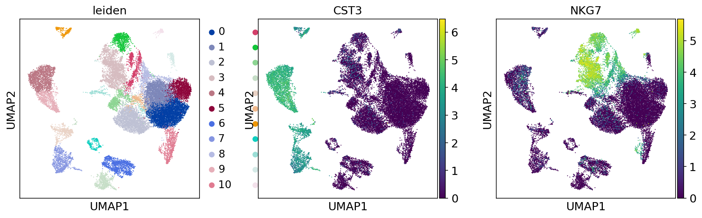

# Single_cell analysis report for 2021 class

## About Dengue: What You Need to Know
Dengue viruses are spread to people through the bite of an infected Aedes species (Ae. aegypti or Ae. albopictus) mosquito. These mosquitoes also spread Zika, chikungunya, and other viruses.
Dengue is common in more than 100 countries around the world.
Forty percent of the world’s population, about 3 billion people, live in areas with a risk of dengue. Dengue is often a leading cause of illness in areas with risk.
Each year, up to 400 million people get infected with dengue. Approximately 100 million people get sick from infection, and 22,000 die from severe dengue.
Dengue is caused by one of any of four related viruses: Dengue virus 1, 2, 3, and 4.  For this reason, a person can be infected with a dengue virus as many as four times in his or her lifetime.
 [source](https://www.cdc.gov/dengue/index.html)

Dengue virus infection presents a wide spectrum of manifestations including asymptomatic condition, dengue fever (DF), or severe forms, such as dengue hemorrhagic fever (DHF) and dengue shock syndrome (DSS) in affected individual
Biomarkers provide a dynamic and powerful approach to understanding the spectrum of disease with applications in observational and analytic epidemiology, randomized clinical trials, screening and diagnosis and prognosis. 
The early prediction of severe dengue in patients without any warning signs who may later develop severe DHF is very important to choose appropriate intensive supportive therapy since available vaccines for immunization are yet to be approved. Severe dengue responses include T and B cell activation and apoptosis, cytokine storm, hematologic disorders and complement activation. Cytokines, complement and other unidentified factors may transiently act on the endothelium and alter normal fluid barrier function of the endothelial cells and cause plasma leakage. The host factors such as activated immune and endothelial cells and their products which can be utilized as biomarkers for severe dengue disease[1](https://dx.doi.org/10.1186%2Fs12929-015-0191-6).

Biomarkers for early detection of SD based on molecular features of the patients blood.
**~ Early detection save lives.**

DEG analysis extracted from blood or peripheral blood mononuclear cells (PBMCs).

The data consists of **4** individuals with **Dengue Positive** and **4 Dengue Negative** or Control and therefore has 8 datsets in total. 

The datasets was Standardize  for each same and merged for  the analysis by using scanpy package. 

Anotation of the genes and custering this highly dimensions data is required to identify groups of cells based on the similarities of the transcripts without any prior knowledge of the labels. Moreover, in most situations we do not even know the number of clusters a priori. The problem is made even more challenging due to the high level of noise (both technical and biological).
